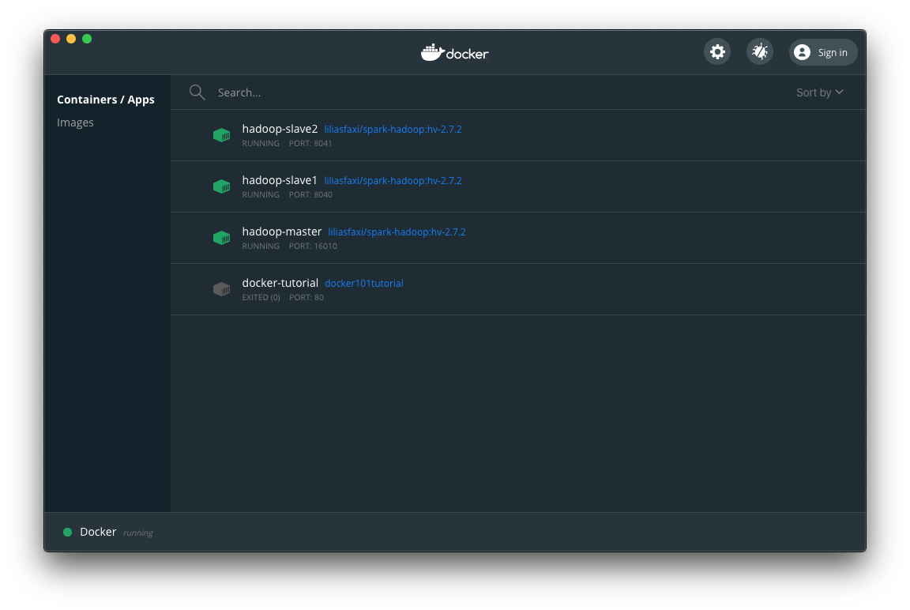

*Sommaire*

[[TOC]]

# Installation de Hadoop via Docker

Les étapes pour installer **hadoop** via _Docker_ sont largement adaptées de la page de [Lilia Sfaxi](https://insatunisia.github.io/TP-BigData/), elles-mêmes reposant sur le projet [github de Kai LIU](https://github.com/kiwenlau/hadoop-cluster-docker).

## Installation de *Docker*

Pour installer *Docker*, merci de suivre les consignes disponibles ici [Docker](https://docs.docker.com/desktop/), en fonction de votre système d'exploitation. Cette étape installe un application appelée _Docker Desktop_, qui aura l'allure suivante une fois les consignes ci-dessous exécutées:

## AUTRE....

Page du container Docker de support au TP : https://hub.docker.com/r/liliasfaxi/spark-hadoop

export STREAMINGJAR='/usr/local/hadoop/share/hadoop/tools/lib/hadoop-streaming-2.7.2.jar'

sur un terminal : docker cp reducer.py hadoop-master:/root/

